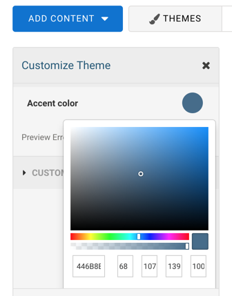

# FormAssembly Theme Creation Guidelines

## Sass 

FormAssembly Themes are build using [Sass](https://sass-lang.com/). 
You may use any of the [Sass features](https://sass-lang.com/guide) like variables, nesting, imports, mixins or 
operators. 

## Theme Customization

Form creators in FormAssembly can apply a theme to their forms but typically do not have direct access to the SCSS to 
make changes. Instead, they have access to a **Theme Editor** that provides simple controls (like a color picker) to 
modify aspects of the theme that you, the designer, chose to make customizable.

**Customization options are exposed through specially constructed SCSS variables.** 
Any variable that starts with `$color-`, `$font-`, `$length-` or `$image-` will automatically be exposed in the 
Theme Editor with a matching control (respectively, a color picker, a font selector, a numeric input with unit selector, 
and a file upload). The rest of the variable name is used as a description of the control.
 
For instance, to make your theme's **accent color** customizable, 

1. Set it as a variable. Let's call it `$color-accent-color`. We use the `$color-` prefix because we want a color 
picker, and 'accent-color' because we want "Accent color" to describe the color picker.  Let's also give it an 
initial value (e.g green).
   ```css
   $color-accent-color: #198a63; 
   ```
2. Now, use the variable accordingly throughout your theme, for instance as the color of the submit button and fieldset 
borders.
   ```css
   .wFormContainer fieldset {
       border-color: $color-accent-color; 
   }
   .wFormContainer input[type='submit'] {
       background-color: $color-accent-color;
   }
   ```
3. That's it! When your theme will be available on FormAssembly, the form creator will be able to control the accent 
color, through a color picker. 
   

### Recommended Customization Options

In some cases you may not want any customization option, for instance when you need to follow strict branding 
guidelines. However, if you're designing a more generic theme, we recommend that you make the following
features customizable: 

1. Logo. 
2. Font Size
3. Font Family
4. Accent Color

### Working with customizable color schemes

When making color a customization option, keep in mind how it may interact with other colors in your theme. For 
instance, if the background color of the form is customizable, you probably need the text color to be customizable as 
well, otherwise users may not be able to keep the text legible with the background color of their choice.   
 
 Example:
 
 ```css
$color-background-color: #ffffff;
$color-text-color: #3d3e44;

.wFormContainer { 
  background-color: $color-background-color;
  color: $color-text-color; 
}
```

### Naming Customization Options

To make it easier for users to understand customization options across different themes, you're encouraged to name your
customization variables according to the following table.

| Variable Name   | Description  |
| ------------- | ------------- | 
| $font-main-font | Font for body text |
| $font-heading-font | Font for headings (form title, fieldset legend, h* tags) |
| $color-text-color | Color for text |
| $color-text-on-accent-color | Color for text when accent-color is used as background color
| $color-accent-color | Accent color
| $color-secondary-color | Secondary accent color
| $color-error-color | Color for error text
| $color-form-background | Background color  (applied on form)
| $color-page-background | Background color  (applied on entire page)
| $color-overlay-background-color | Background color for overlays (calendar, pop-up hints)
| $image-logo-image | Logo image (file upload)
| $length-logo-size | Logo size (in rem)
| $length-scale-size | Base font-size (in rem or %)

## Sizes & Scalability

1. **Set your base font-size on the top-level container, as a variable.**
2. **Use relative units (EM or %) elsewhere.**

While not strictly required, Themes can be designed to let form creators easily scale the entire form to fit their 
particular use case: Large text and lot of white-space, or small font and higher density. To achieve this, set 
the font size on the `.wFormContainer` as a variable ($length-scale-size), and set all other font-sizes, padding and 
margins with relative units (ems).  

#### Example:
```css
$length-scale-size: 1rem; 
.wFormContainer {
	font-size: $length-scale-size;
}
/* ... */
.wFormContainer h4 { 
    font-size: 1.5em; 
    margin: 1em 0; 
}
```

## CSS Selectors
1. **Use selectors provided by the template when possible.**
2. **Use `.wFormContainer` to scope your css rules.**

For convenience, the template provide CSS selectors for most form elements. 

For technical reasons, the markup for certain form elements (like labels) differs between the form preview, in the Form Builder, and the live form. To ensure that the theme renders properly, use the selectors provided by the template (e.g. use the `.label` class instead of the `label` tag)

Scoping css selectors with the  `.wFormContainer` class is indispensable to prevent theme styles from leaking into the Form Builder's user interface, and  the user's website (once the form is published). 

```css
/* GOOD */
.wFormContainer .label {
	color: green;
}

/* BAD - not scoped to .wFormContainer, not using .label as selector (as provided by template) */
label {
	color: green;
}
```
## Form Layouts

Form creators are given a wide range of layout options in the Form Builder. The theme's preview page  provides examples 
for each. Your SCSS must not conflict with the underlying CSS and break those layouts. In particular,
**you should not use styles that affect:**
1. The relative position of the label and its input (above, below, to the side, etc.).
2. The relative position of a field hint and its input (below, floating, etc.).
3. The max-width of text inputs, max-width of labels, max-width and max-height of textareas.
4. The visibility of form elements.
5. The visibility of fieldset borders.
6. The relative position of fields placed on the same line.
7. Text alignment. 

## Responsive Forms

Themes created through the Theme Dev Kit are responsive by default and should work fine on any device, as long as you
don't interfere with layout in your scss.  

### Media Queries

To ensure that your theme renders accurately in the Form Builder's preview, make sure that any CSS that is scoped to
a media query is also scoped to the Form Builder's preview divs: `#device.mobile` and `#device.tablet`.

Example:
```css
@media only screen and (min-device-width: 360px) and (max-device-height: 640px) and (orientation : portrait) {
   .wFormContainer fieldset { padding: 1em; }
}
#device.mobile {
    .wFormContainer fieldset { padding: 1em; }
}
```

## Quality Control Checklist

1. Read-only fields should not look like editable fields. A darker background is usually acceptable.
2. Placeholder text should not look like user input. A lighter, faded hue is usually acceptable.
4. Contrast between text and background color must meet [WCAG 2.0 accessibility guidelines](https://www.w3.org/WAI/tips/designing/#provide-sufficient-contrast-between-foreground-and-background).
(may not apply if both are customizable.)
5. Interactive elements (buttons, links) must be easy to identify.
6. Calendar on Date field should match the color scheme of the form.
7. Height of Select field (drop-down menu) should match the height of text inputs.
